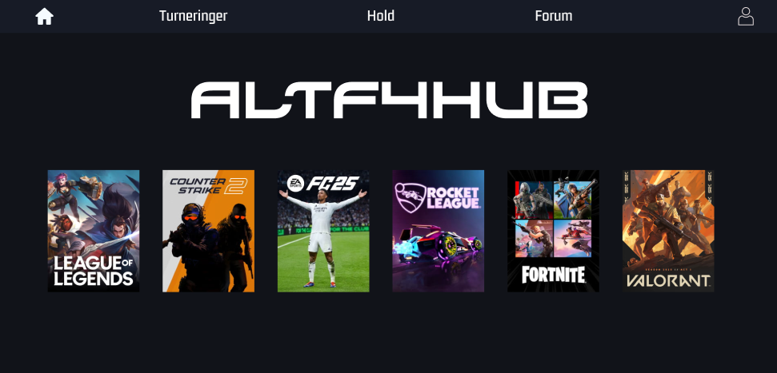

<!--
CountAPI failed

-->

### Hi there 👋, my name is Mateen Jan Rafiq
#### 📍 I'm from Denmark, currently living in Copenhagen.
#### 📚 23-year old aspiring Full-Stack Developer currently studying at CPHBusiness
#### 🏢 I work as a Student Assistant at Danish Technological Institute
#### 🌞 When I'm not crushing bugs or building dreams, I can be found playing football ⚽, lifting weights 🏋️, boxing 🥊, and spending quality time with family and friends ❤️

Skills: JAVA / REACT / JS / SQL / PYTHON / C# / LINUX / UBUNTU / UNITY / CI/CD / HTML / CSS 

## 🔭 I'm currently working on

